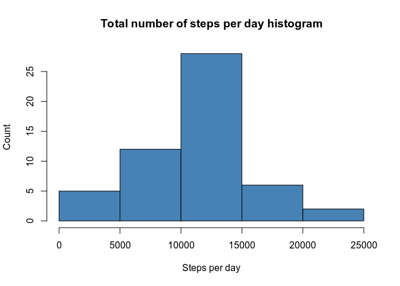
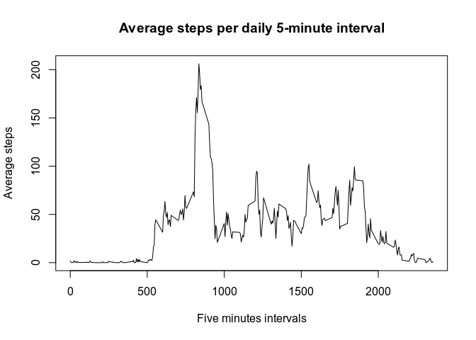
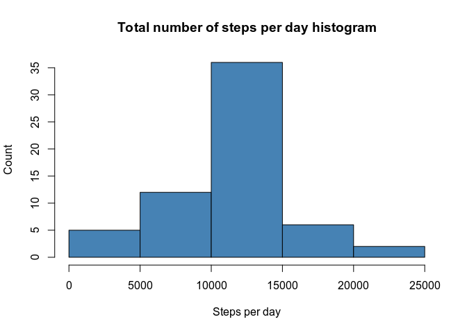
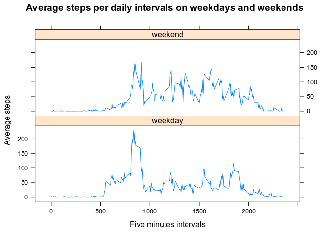

# Loading and preprocessing the data

Let's use the `read_csv()` function from the `readr` package to read the data in.


```r
library(readr)

activity <- read_csv("activity.zip")

activity
# A tibble: 17,568 x 3
   steps date       interval
   <dbl> <date>        <dbl>
 1    NA 2012-10-01        0
 2    NA 2012-10-01        5
 3    NA 2012-10-01       10
 4    NA 2012-10-01       15
 5    NA 2012-10-01       20
 6    NA 2012-10-01       25
 7    NA 2012-10-01       30
 8    NA 2012-10-01       35
 9    NA 2012-10-01       40
10    NA 2012-10-01       45
# … with 17,558 more rows

sapply(activity, class)
    steps      date  interval 
"numeric"    "Date" "numeric" 
```

As we can see, the `read_csv()` function:

  - Handles compressed files.  
  - Returns a `tibble` with:  
      - the `date` variable already formatted as variable of class `Date`;  
      - the `steps` and `interval` variables as `numeric` variables.  


# What is mean total number of steps taken per day?

As requested by the assignment instructions, in this section we'll ignore *missing values* and proceed as follows.

## Make a histogram of the total number of steps taken each day

First, we **summarize the total number of steps taken per day**.


```r
library(dplyr)

stepsPerDay <- activity %>% 
        na.omit %>%                       ## Ignoring NAs.
        group_by(date) %>% 
        summarize(total = sum(steps))

stepsPerDay
# A tibble: 53 x 2
   date       total
   <date>     <dbl>
 1 2012-10-02   126
 2 2012-10-03 11352
 3 2012-10-04 12116
 4 2012-10-05 13294
 5 2012-10-06 15420
 6 2012-10-07 11015
 7 2012-10-09 12811
 8 2012-10-10  9900
 9 2012-10-11 10304
10 2012-10-12 17382
# … with 43 more rows
```

Then, we make a **histogram of the total number of steps per day**.


```r
hist(stepsPerDay$total, col = "steelblue",
     xlab = "Steps per day", ylab = "Count",
     main = "Total number of steps per day histogram")
```

<!-- -->

## Calculate and report the mean and median total number of steps taken per day

We can use the `summary()` function to calculate the ***mean*** and ***median*** **total number of steps taken per day**.


```r
stepsPerDay_smries <- summary(stepsPerDay$total)
stepsPerDay_smries
   Min. 1st Qu.  Median    Mean 3rd Qu.    Max. 
     41    8841   10765   10766   13294   21194 
```

As we can see, the *mean* and the *median* are practically the same:

  - The **mean total number of daily steps** is **10766**.  
  - The **median total number of daily steps** is **10765**.  


# What is the average daily activity pattern?

## Make a time series plot of the 5-minute interval (x-axis) and the average number of steps taken, averaged across all days (y-axis)

In order to make the requested time series plot, we start by **summarizing the average steps per intervals**.


```r
library(dplyr)

stepsPerIntervals <- activity %>% 
        na.omit %>%                       ## Ignoring NAs.
        group_by(interval) %>% 
        summarize(mean = mean(steps))

stepsPerIntervals
# A tibble: 288 x 2
   interval   mean
      <dbl>  <dbl>
 1        0 1.72  
 2        5 0.340 
 3       10 0.132 
 4       15 0.151 
 5       20 0.0755
 6       25 2.09  
 7       30 0.528 
 8       35 0.868 
 9       40 0     
10       45 1.47  
# … with 278 more rows
```

So here's a **time series plot** of the average steps taken in each of the five minutes intervals, in which each day of the two month period is divided in.


```r
with(stepsPerIntervals, plot(interval, mean, type = "l",
                             xlab = "Five minutes intervals",
                             ylab = "Average steps",
                             main = "Average steps per daily 5-minute interval"))
```

<!-- -->

## Which 5-minute interval, on average across all the days in the dataset, contains the maximum number of steps?

To answer this question:

 - We'll first find the index of the maximum avarage number of steps taken in a 5-minute interval.  
 - And then use that index to subset the corrisponding interval in which that maximum occurs.  


```r
stepsPerIntervals_maxIdx <- which.max(stepsPerIntervals$mean)
maxStepsInterval <- stepsPerIntervals$interval[stepsPerIntervals_maxIdx]
maxStepsInterval
[1] 835
```

So, the daily 5-minute interval where the average maximum number of steps takes place is **the interval 835**.


# Imputing missing values

## Calculate and report the total number of missing values in the dataset

To accomplish this task, we can apply the `summary()` function to our entire datset.


```r
activity_smries <- summary(activity)
activity_smries
     steps             date               interval     
 Min.   :  0.00   Min.   :2012-10-01   Min.   :   0.0  
 1st Qu.:  0.00   1st Qu.:2012-10-16   1st Qu.: 588.8  
 Median :  0.00   Median :2012-10-31   Median :1177.5  
 Mean   : 37.38   Mean   :2012-10-31   Mean   :1177.5  
 3rd Qu.: 12.00   3rd Qu.:2012-11-15   3rd Qu.:1766.2  
 Max.   :806.00   Max.   :2012-11-30   Max.   :2355.0  
 NA's   :2304                                          
```

This shows us that the **only variable that contains missing values** is the `steps` variable, with a **total number of 2304 NA's**.

## Devise a strategy for filling in all of the missing values in the dataset

Let's fill in the missing steps values in a given 5-minutes interval, with the **mean for that 5-minutes interval**.

  - So, this strategy assumes that the subject mantains the same behaviour on average.  
  
  - Consequently, we expect that the new average values that we'll explore basically will not differ from those previously calculated.  

**To do so**, we're going to:

  - Group our orginal dataset by the variable `interval`.  
  
  - Create a new column, called `interval.mean`, containing the mean of each of the 5-minute intervals in which all days of the two month period are divided in.  
  
  - Finally, fill in the missing values of the `steps` variable with the corrisponding `interval.mean` values.  


```r
library(dplyr)

activity_filledIn <- activity %>% 
        group_by(interval) %>% 
        mutate(interval.mean = mean(steps, na.rm = TRUE)) %>% 
        mutate(steps = ifelse(is.na(steps), interval.mean, steps))

activity_filledIn
# A tibble: 17,568 x 4
# Groups:   interval [288]
    steps date       interval interval.mean
    <dbl> <date>        <dbl>         <dbl>
 1 1.72   2012-10-01        0        1.72  
 2 0.340  2012-10-01        5        0.340 
 3 0.132  2012-10-01       10        0.132 
 4 0.151  2012-10-01       15        0.151 
 5 0.0755 2012-10-01       20        0.0755
 6 2.09   2012-10-01       25        2.09  
 7 0.528  2012-10-01       30        0.528 
 8 0.868  2012-10-01       35        0.868 
 9 0      2012-10-01       40        0     
10 1.47   2012-10-01       45        1.47  
# … with 17,558 more rows
```

## Create a new dataset that is equal to the original dataset but with the missing data filled in

At this point we just have to replace the `steps` column of the original `activity` dataset, with the `steps` column from the `activity_filledIn` dataset.


```r
library(dplyr)

activity_new <- activity %>% 
        mutate(steps = activity_filledIn$steps)

activity_new
# A tibble: 17,568 x 3
    steps date       interval
    <dbl> <date>        <dbl>
 1 1.72   2012-10-01        0
 2 0.340  2012-10-01        5
 3 0.132  2012-10-01       10
 4 0.151  2012-10-01       15
 5 0.0755 2012-10-01       20
 6 2.09   2012-10-01       25
 7 0.528  2012-10-01       30
 8 0.868  2012-10-01       35
 9 0      2012-10-01       40
10 1.47   2012-10-01       45
# … with 17,558 more rows

sum(is.na(activity_new$steps))            ## No more NAs.
[1] 0
```

## Make a histogram of the total number of steps taken each day, and calculate and report the mean and median total number of steps taken per day

We'll reproduce with our new dataset (`activity_new`), the same steps we did before with the original dataset (`activity`):

  - First, **summarize the total number of steps taken per day**.


```r
library(dplyr)

stepsPerDay_new <- activity_new %>% 
        group_by(date) %>% 
        summarize(total = sum(steps))

stepsPerDay_new
# A tibble: 61 x 2
   date        total
   <date>      <dbl>
 1 2012-10-01 10766.
 2 2012-10-02   126 
 3 2012-10-03 11352 
 4 2012-10-04 12116 
 5 2012-10-05 13294 
 6 2012-10-06 15420 
 7 2012-10-07 11015 
 8 2012-10-08 10766.
 9 2012-10-09 12811 
10 2012-10-10  9900 
# … with 51 more rows
```

  - Then, make the **histogram of the total number of steps per day**.


```r
hist(stepsPerDay_new$total, col = "steelblue",
     xlab = "Steps per day", ylab = "Count",
     main = "Total number of steps per day histogram")
```

<!-- -->

  - Calculate and report the **mean and median total number of steps taken per day**.


```r
stepsPerDay_new_smries <- summary(stepsPerDay_new$total)
stepsPerDay_new_smries
   Min. 1st Qu.  Median    Mean 3rd Qu.    Max. 
     41    9819   10766   10766   12811   21194 
```

### Do these values differ from the estimates from the first part of the assignment?

As we expected, the **mean and median total number of daily steps** obtained in the new dataset:

  - **mean**: **10766**;  
  - **median**: **10766**;  

***are practically the same*** from those we've calculated before from the original dataset.

**However**, as the **proportion of missing values** within the hole dataset **(13 percent)** is ***not entirely irrelevant***, another imputing missing values strategy would've altered these average values with some relevant degree of incidence.

### What is the impact of imputing missing data on the estimates of the total daily number of steps?

Both histograms show us that:

  - the data distribution remains unchanged;  
  
  - and that the impact of our imputing missing data strategy is expressed in a uniformly proportional growth of the total daily number of steps.  


# Are there differences in activity patterns between weekdays and weekends?

## Create a new factor variable in the dataset with two levels -- "weekday" and "weekend" indicating whether a given date is a weekday or weekend day

Let's create this new factor variable in the new filled-in missing values dataset (`activity_new`), using the `mutate()` function and calling it `type.of.day`.


```r
library(dplyr)

activity_new <- activity_new %>% 
        mutate(type.of.day = factor(ifelse(weekdays(date)=="sábado" |
                                           weekdays(date)=="domingo",
                                           "weekend", "weekday"),
                                    levels = c("weekday", "weekend")))
activity_new
# A tibble: 17,568 x 4
    steps date       interval type.of.day
    <dbl> <date>        <dbl> <fct>      
 1 1.72   2012-10-01        0 weekday    
 2 0.340  2012-10-01        5 weekday    
 3 0.132  2012-10-01       10 weekday    
 4 0.151  2012-10-01       15 weekday    
 5 0.0755 2012-10-01       20 weekday    
 6 2.09   2012-10-01       25 weekday    
 7 0.528  2012-10-01       30 weekday    
 8 0.868  2012-10-01       35 weekday    
 9 0      2012-10-01       40 weekday    
10 1.47   2012-10-01       45 weekday    
# … with 17,558 more rows

table(activity_new$type.of.day)

weekday weekend 
  12960    4608 
```

## Make a panel plot containing a time series plot of the 5-minute interval (x-axis) and the average number of steps taken, averaged across all weekday days or weekend days (y-axis)

 - Let's begin **grouping by `type.of.day` and `interval`, and summarize the average steps**.  


```r
library(dplyr)

stepsPerTypeOfDays <- activity_new %>% 
        group_by(type.of.day, interval) %>% 
        summarize(mean = mean(steps))

stepsPerTypeOfDays
# A tibble: 576 x 3
# Groups:   type.of.day [2]
   type.of.day interval   mean
   <fct>          <dbl>  <dbl>
 1 weekday            0 2.25  
 2 weekday            5 0.445 
 3 weekday           10 0.173 
 4 weekday           15 0.198 
 5 weekday           20 0.0990
 6 weekday           25 1.59  
 7 weekday           30 0.693 
 8 weekday           35 1.14  
 9 weekday           40 0     
10 weekday           45 1.80  
# … with 566 more rows
```

  - Here's the requested **panel plot**.  


```r
library(lattice)

xyplot(mean ~ interval | type.of.day, data = stepsPerTypeOfDays,
       layout = c(1, 2),
       type = "l",
       xlab = "Five minutes intervals",
       ylab = "Average steps",
       main = "Average steps per daily intervals on weekdays and weekends")
```

<!-- -->

As we can see:

  - There are more average steps in the first intervals of the day on weekdays, than on weekends (the subject begins to move earlier on weekdays).  
  
  - The average steps in the following intervals of the day are bigger on weekends, than they are on weekdays (the subject tends to move more during the rest of the day on weekends).  
  
***
